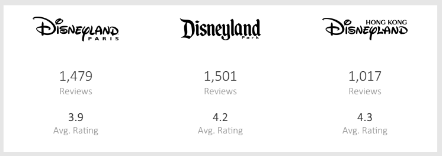
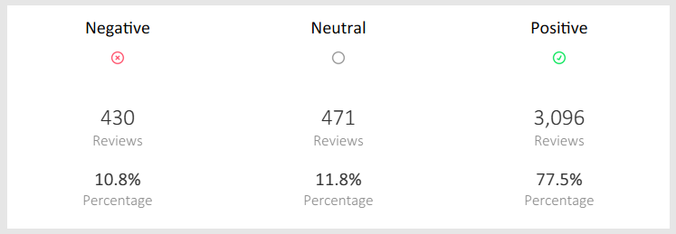
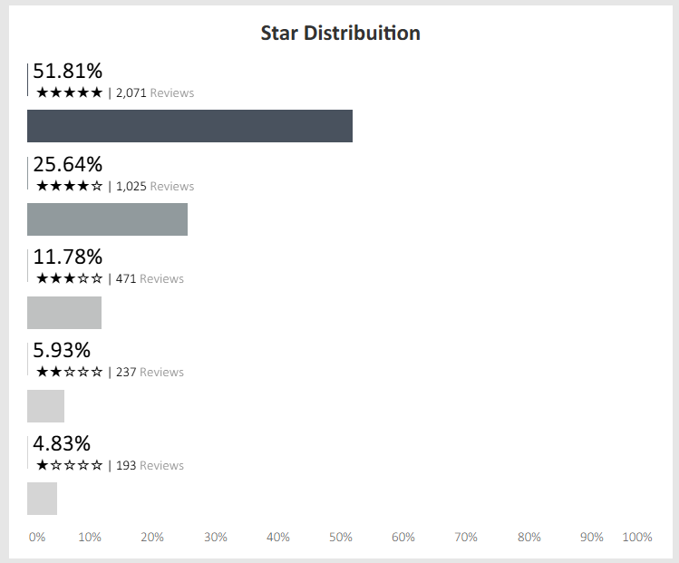
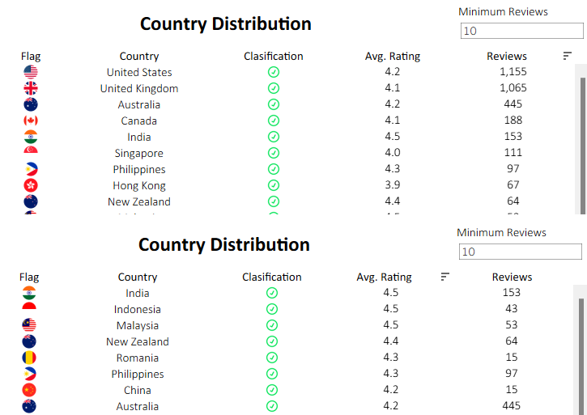
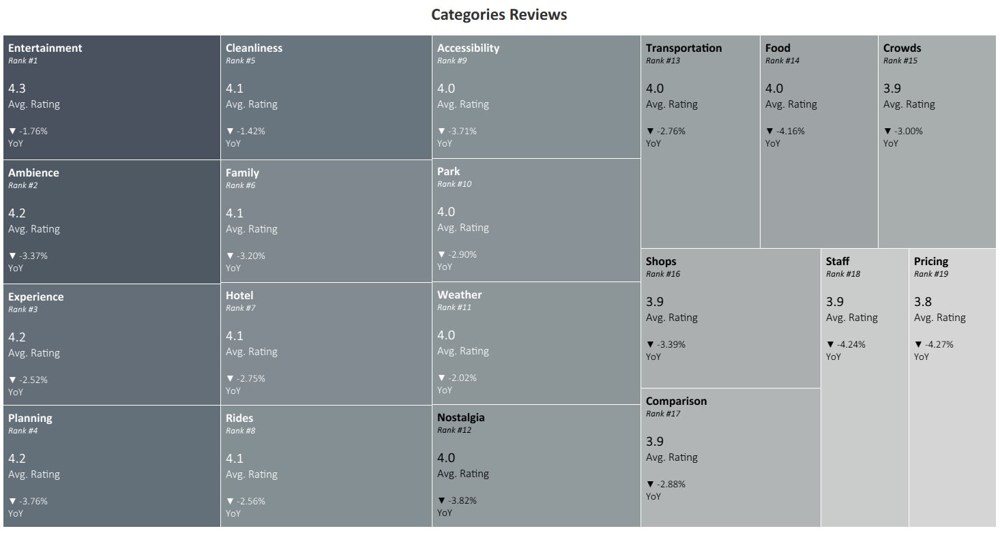

# Disneyland-Reviews-Analytics

## 📘 Background and Overview
This project is a complete analytics case study combining Python for data preparation and enrichment with Tableau for visualization. The dataset, sourced from Kaggle, contains thousands of reviews from visitors to Disneyland California, Paris, and Hong Kong. Each record includes the reviewer’s country of origin, rating (1–5), review date (month/year), and free-text review content.

The project demonstrates key data analysis and engineering skills:

Data Cleaning & Transformation (Python): handling duplicates, removing unnecessary columns, and text preprocessing.

Natural Language Processing (Zero-Shot Classification): extracting thematic categories from review texts (e.g., food, staff, rides, pricing, crowds) to enrich the dataset with new analytical dimensions.

Exploratory & Explanatory Data Analysis (Tableau): building dashboards to uncover visitor satisfaction trends, regional differences, and operational insights across the three parks.

This approach highlights how unstructured text can be transformed into structured business insights, showcasing technical proficiency in data wrangling, machine learning (NLP), and interactive visualization.

### 🔗 Key Project Assets

- 📄 [Data Cleanning and Transformation](https://github.com/andrezrg/Disneyland-Reviews-Analytics/blob/main/disneyland-reviews/data-transformation.ipynb)
- 🗂️ [Kaggle Dataset](https://www.kaggle.com/datasets/arushchillar/disneyland-reviews)
- 📈 [Interactive Tableau Dashboard](https://public.tableau.com/app/profile/andr.s.ram.rez.guill.n/viz/disneyland-reviews/Dashboard?publish=yes)

## 🔍 Insights

The Tableau dashboard provides a comprehensive view of visitor satisfaction across Disneyland California, Paris, and Hong Kong. Below is a breakdown of the most impactful insights derived from the reviews dataset:

### 🎢 Disneyland Parks KPIs
- **Disneyland California** consistently achieves the **highest average ratings**, while also being the park with the **largest review volume per year**.
- **Hong Kong** outperforms Paris in terms of average review score, despite having fewer reviews.
- Across all parks, the **average rating remains positive (4.0–4.5)**, though Paris dipped to **3.9 in certain years**, recovering in recent periods.

### 📊 Classification KPI
- Reviews were grouped into **Positive, Neutral, and Negative** categories using text classification.
- On average, **~75% of annual reviews** fall into the **Positive** category across all parks.
- Neutral reviews consistently take second place, while negative reviews remain the minority.

### ⭐ Star Distribution
- Review distribution shows a clear **skew toward 5-star ratings**, followed by 4-star, with decreasing frequency down to 1-star.
- This trend has remained stable over time, reinforcing the generally positive perception of the parks.

### 🌍 Country Distribution
- The top countries by review count are **USA, Canada, Australia, and the UK**.
- Interestingly, these countries do not always yield the highest average ratings, with recent years averaging **4.1–4.2**.
- By filtering countries with at least **10 reviews**, patterns emerge:
  - In **2018**, **India, Indonesia, and Malaysia** recorded the highest averages.
  - In **2017**, **Brazil, Philippines, and Greece** led in satisfaction.
- This dynamic highlights the value of filtering noise from countries with very few reviews.

### 🏷️ Categories Reviews
- Using Zero-Shot classification, reviews were assigned to categories such as **Entertainment, Planning, Environment, Pricing, Staff, etc**.
- The **highest-rated categories** are consistently **Entertainment, Planning, and Environment**.
- **Pricing and Staff** receive the **lowest ratings**, averaging between **3.9–4.0**.
- A **YoY comparison** reveals dips in 2018 for the top three categories compared to 2017.

These insights collectively demonstrate how combining **text classification, review metadata, and interactive dashboards** can uncover trends in customer satisfaction and identify focus areas for operational improvement across different parks and demographics.

## 🧭 Recommendations

Based on the insights extracted from the Disneyland reviews dataset and visualized in Tableau, the following strategic recommendations are proposed:

### 🎢 Enhance Park Experience
- Focus on improving aspects highlighted in **low-rated categories**, such as **Pricing** and **Staff**, to boost overall visitor satisfaction.
- Maintain the quality in top-rated areas (**Entertainment, Planning, and Environment**) while exploring ways to innovate or expand attractions.

### 🌍 Targeted International Engagement
- Identify countries with fewer but high-rated reviews (e.g., India, Indonesia, Malaysia, Brazil, Philippines, Greece) to tailor marketing campaigns or visitor programs.
- Filter out noise from countries with very few reviews to focus on actionable trends for international visitors.

### 📊 Continuous Feedback Monitoring
- Implement ongoing review analysis to track shifts in category ratings YoY, identifying areas that need immediate operational attention.
- Use NLP-based classification to uncover emerging concerns or positive trends not visible in raw star ratings.

### ⭐ Celebrate Positive Highlights
- Promote consistently high-rated experiences (Entertainment, Planning, Environment) in marketing campaigns to reinforce the park's strengths.
- Highlight visitor testimonials in these categories on digital channels to attract new visitors.

### 🛠 Operational Adjustments
- Allocate additional staff or resources to address common pain points identified in negative reviews.
- Consider pricing strategies or packages to improve perception in the **Pricing** category.

These recommendations aim to provide actionable insights that Disneyland management could implement to enhance visitor satisfaction and operational efficiency across California, Paris, and Hong Kong parks.
